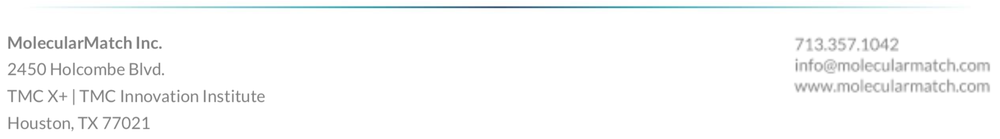

## MolecularMatch Publications 2019 Update

Publication search has expanded in importance in recent years at MM due to our in-house curation requirements and necessity to assert all recommendations with [literature evidence](https://api.molecularmatch.com/#aboutCompliance). With our search engine expertise, we have created the most clinically relevant and user friendly publication search in the industry. Our goal is that the most relevant results show up in the top 10 for any clinical oncology search.

Publications are continually updated, scored, sorted, and MLA cited for you to easily incorporate into your products.

- [API Publication Search](https://api.molecularmatch.com/#publications)
- [API Assertions Search](https://api.molecularmatch.com/#assertions)

MolecularMatch indexes publications in several ways:

1. Weekly acquisition of new publications from PubMed
2. Conference Meeting Abstracts (ASCO, AACR, ESMO)
3. NCCN Guideline cited publications
4. In-house medical curator findings
5. Additions of publications by our network of users

---------

### Scoring System Explained

Publications, like our Trials, Drugs and Assertions, are accessed through our API endpoints. They are returned sorted based on a highly advanced scoring system. Through extensive testing with M.D. and Ph.D. oversight, we've developed a publication search engine that is most likely to have results relevant to your case.

Scores are made up of a combination of *intrinsic* and *extrinsic* values.

Intrinsic scores are related to attributes of the publication, such as:

1. Journal Impact Factor
2. Number of citations (PubMed Central citation count)
3. Number of assertions within MM where curators added this publication
4. Number (and quality) of evidence items in CIViCdb.org referencing this publication
5. Publication Types (scores adjust up or down)
6. Trial Types (scores adjust up or down)

The extrinsic score of publications is calculated at search time by matching your search criteria to information on the abstract. For example, terms matched in the title are given preference to terms found lower in the abstract, like in the methods section.

#### Publication Types and Trial Types for score adjustments

Publication Types influence the intrinsic score.

The highest scoring publications will be those of clinical utility such as those corresponding to clinical trials (higher phases scoring higher), interventional treatments, practice guidelines, case studies, consensuses, etc. Lower scoring publications will correspond with observational research only, animal models, cell-lines, etc.

#### Test Suite Curation

Publication ranking has been validated through hundreds of test suites. Test suites represent patient cases (gene/variant + condition), and we use them to check and adjust the ranking of publications so that the most relevant come up first.

If users find any publications we are missing from our index, they can submit them by PubMed ID to our support email. They will then be acquired, tagged and served back through the API.

---------

 
 
 
 
 

