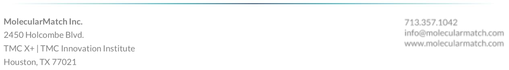

## MolecularMatch Trial Search Update (July, 2019)

MolecularMatch was founded on idea of making clinical trial search better. Better for doctors, better for patients, better for health technology integrators. The scoring algorithm we developed, [patented](https://patents.google.com/patent/US20160117470A1/), and continually improve, is how we deliver this value.

With our search engine expertise, we have created the most clinically relevant and user friendly trial search in the industry. Our goal is that the most relevant results show up in the top 10 for any clinical oncology search. This means patients have a better chance to get the right treatment.

Trials are continually updated, scored, and sorted for you to easily incorporate into your products. You will find them in our API or Portal.

- [Trial Search API](https://api.molecularmatch.com/#clinicaltrials)
- [Search Portal Application](https://app.molecularmatch.com)

---------

### Search Filtering

The most important factor affecting your search results is what filters are matched, and what is filtered out because of your inputs. Inputs span [everything from Age, Mutation to Geo-Location and more.](https://api.molecularmatch.com/#knowledgeDomains)

Your inputs are matched to different parts of the trial like title, summary and inclusion criteria. When inputs match exclusion criteria, those trials are filtered out from the results.

The ranking of the results depends on where in the trial your filters matched, as well as being based on our curation team's efforts to boost the most important factors of trials.

### Scoring System Explained

Scoring is different than filtering.

Trials are accessed through API endpoints or search portals. They are returned sorted based on a highly advanced scoring system. Through extensive testing with M.D. and Ph.D. oversight, we've developed a search engine that is most likely to have results relevant to your case.

Scores are made up of a combination of **intrinsic** and **extrinsic** values.

**Intrinsic** scores are related to attributes of the trial, such as:

1. Trial Types (scores adjust up or down).
2. Phase (III > II > I)

The **extrinsic** score is calculated at search time by matching your search criteria to information on the trial. For example, terms matched in the title are given preference to terms found in the summary automatically. However, the curation continuously overrides this logic by adjusting the priorities of terms based on their scientific understanding of the trial.

#### Trial Types for score adjustments

Trial Types influence the intrinsic score.

The **highest scoring** trials will be those of clinical utility such as those corresponding to clinical trials (higher phases scoring higher), interventional treatments, practice guidelines, case studies, consensuses, etc. **Lower** scoring publications will correspond with observational research only, animal models, cell-lines, etc.

### Test Suite Curation

Tuning the algorithm is a frequent task as we learn new things about trials and get additional oversight from clients and internal curation teams.

Ranking has been validated through hundreds of test suites. Test suites represent patient cases (gene/variant + condition), and we use them to check and adjust the ranking of trials so that the most relevant come up first.

Curation is also how we develop our [biomedical rules engine](https://api.molecularmatch.com/#biomedicalRules) for further tuning.

### Trial Acquisition and Registry Coverage

In 2008, the World Medical Association's Declaration of Helsinki stated that, "Every clinical trial must be registered in a publicly accessible database before recruitment of the first subject." This spurred many countries to start their own clinical trial registries, or to conform to the standards of other major registries like the US's ClinicalTrials.gov. Many organizations now choose to list their trials in a major registry, their home registry, or both.

At MolecularMatch we bring in all trials and merge them into a consistent format; eliminating duplicates across registries and fill in missing data. We keep this data updated so that we can be sure to contain the majority of registered trials in a format for our algorithms to process, and for our users to distribute information to medical practices around the globe.

#### Public Registries Incorporated into MM Database

MolecularMatch indexes trials based on a weekly acquisition of trials from a global collection of registries.

| Registry Code | Registry Name | Count |
|---|---|---|
| CTGOV | ClinicalTrials.gov | **252,112** |
| UMIN | University Hospital Medical Information Network (Japan) | **5,179** |
| ANZCTR | Australia/New Zealand Clinical Trials Registry | **4,979** |
| ChiCTR | Chinese Clinical Trials Registry | **4,031** |
| DRKS | German Clinical Trials Registry | **3,165** |
| IRCT | Iranian Registry of Clinical Trials | **2,953** |
| EUCTR | European Clinical Trials Registry | **1,965** |
| ISRCTN | International Standard Registry of Clinical Trials | **1,855** |
| CTRI | Indian Clinical Trials Registry | **1,456** |
| NTR | Netherlands Trial Registry | **773** |
| CRIS | Clinical Research Information Service (Korea) | **476** |
| TCTR | Thai Clinical Trials Registry | **422** |
| REBEC | Brazilian Clinical Trials Registry | **374** |
| PACTR | Pan African Clinical Trials Registry | **174** |
| JapicCTI | Japan Pharmaceutical Information Center - Clinical Trials Information  | **115** |
| REPEC | Peruvian Clinical Trial Registry | **70** |
| JMACCT | Japan Medical Association - Center for Clinical Trials | **49** |
| SLCTR | Sri Lanka Clinical Trials Registry | **31** |
| RPCEC | Cuban Public Registry of Clinical Trials | **8** |
*counts from: 04/10/2018*

#### Registry Merging

Many trials are listed on _more than one_ registry. We handle that by registry priority and secondary identification. For example, if a trial coming in from UMIN has a secondary identifier that is a NCT. No. from ClinicalTrials.gov, this trial will not make into the final trial table. Instead, a link between the two are created and it is skipped because we already have it from a better source.

### Trial Site Geo-Location Enhancements

One of our biggest value additions has been our geo-location and medical group enhancements. Through Google Maps integration, we continuously find the locations of trial sites around the world. We've added millions of addresses for sites that otherwise were not given on the registry. This allows features like [distance-based](https://api.molecularmatch.com/#domainDistance) and medical group searches; that way you can find trials for your patients near you, or at your institution. Only with MolecularMatch is this advanced level of geo-location available.

Thousands of hospitals, universities, pharmaceutical / biotechnology companies, contract research organizations, government entities and clinics are represented in the system.

### Datasets: World Map of Trials

We can easily develop datasets and analytics through our deep understanding of trial data. This data can be used by a variety of industries like medical, financial, research and pharmaceutical groups.

##### Germany, France lead Europe

##### China, Japan, Korea lead Asia

##### Brazil, Argentina lead South America

##### Turkey, Iran, Egypt lead the Middle East / North Africa region

##### South Africa, Uganda and Kenya lead

##### Total Counts - *(for countries > 3 trials)*

---------

 
 

