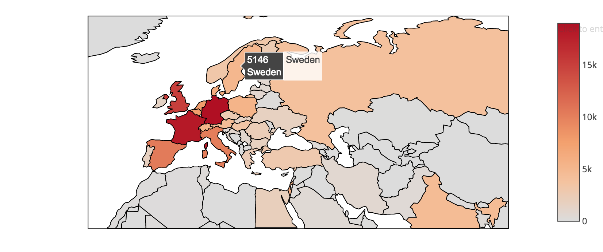
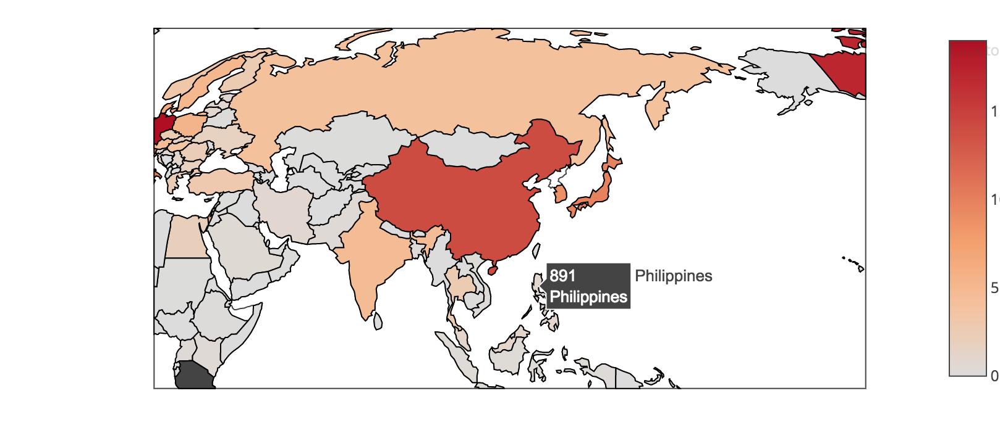
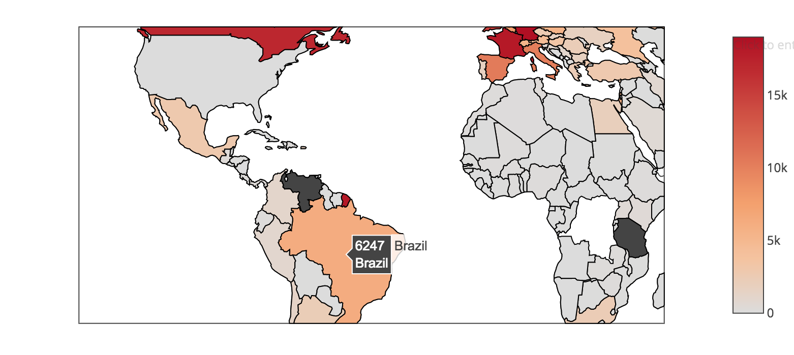
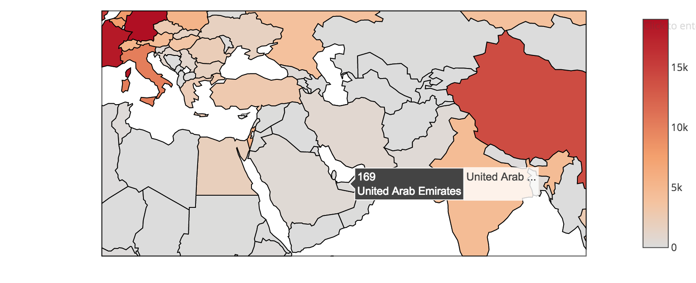
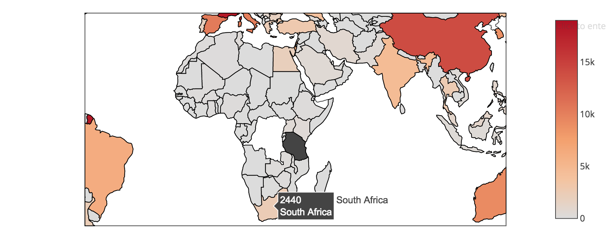
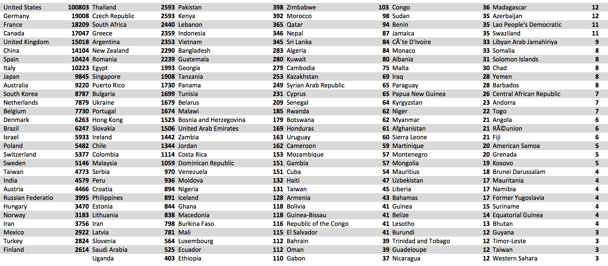
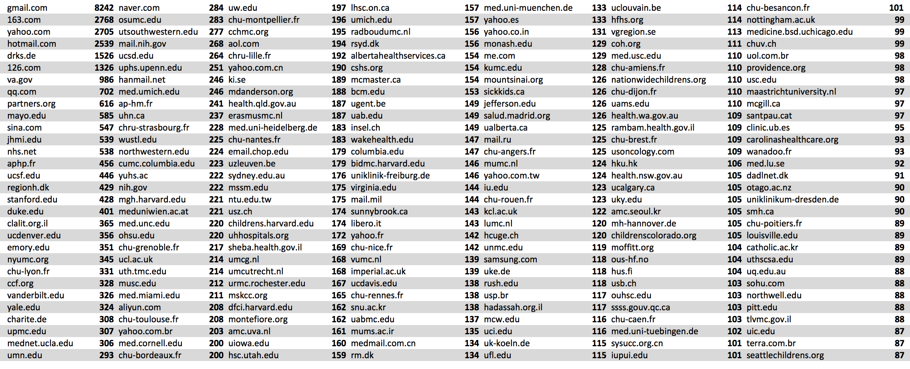

## MolecularMatch Clinical Trials 2018 Update

In 2008, the World Medical Association's Declaration of Helsinki stated that, "Every clinical trial must be registered in a publicly accessible database before recruitment of the first subject." This spurred many countries to start their own clinical trial registries, or to conform to the standards of other major registries like the US's ClinicalTrials.gov. Many organizations now choose to list their trials in a major registry, their home registry, or both. At MolecularMatch we bring in all trials, and merge it into a consistent format, eliminating duplicates across registries and fill in missing data. We keep this data updated so that we can be sure to contain the majority of registered trials in a format for our algorithms to process, and for our users to distribute information to medical practices around the globe.

---------

### Public Registries Incorporated into MM Database

| Registry Code | Registry Name | Count |
|---|---|---|
| CTGOV | ClinicalTrials.gov | **252,112** |
| UMIN | University Hospital Medical Information Network (Japan) | **5,179** |
| ANZCTR | Australia/New Zealand Clinical Trials Registry | **4,979** |
| ChiCTR | Chinese Clinical Trials Registry | **4,031** |
| DRKS | German Clinical Trials Registry | **3,165** |
| IRCT | Iranian Registry of Clinical Trials | **2,953** |
| EUCTR | European Clinical Trials Registry | **1,965** |
| ISRCTN | International Standard Registry of Clinical Trials | **1,855** |
| CTRI | Indian Clinical Trials Registry | **1,456** |
| NTR | Netherlands Trial Registry | **773** |
| CRIS | Clinical Research Information Service (Korea) | **476** |
| TCTR | Thai Clinical Trials Registry | **422** |
| REBEC | Brazilian Clinical Trials Registry | **374** |
| PACTR | Pan African Clinical Trials Registry | **174** |
| JapicCTI | Japan Pharmaceutical Information Center - Clinical Trials Information  | **115** |
| REPEC | Peruvian Clinical Trial Registry | **70** |
| JMACCT | Japan Medical Association - Center for Clinical Trials | **49** |
| SLCTR | Sri Lanka Clinical Trials Registry | **31** |
| RPCEC | Cuban Public Registry of Clinical Trials | **8** |

Note that some are underutilized; as there are over 6,000 clinical trials with a site or contact in Brazil (mostly in ClinicalTrials.gov), but only 371 trials in Brazil's registry REBEC. Likewise, middle east countries may register on Iran's well supported registry IRCT.

Additional registries worth integrating are: Switzerland's **KOFAM**, the US's **NCI** registry, Spain's **REES** registry, and industry sponsored and local institutional databases.

---------

### Registry Merging
Many trials are listed on more than one registry, and we handle that by registry priority and secondary identification. For example, if a trial coming in from UMIN has a secondary identifier that is a NCT. No. from clinicaltrials.gov, this trial will not make into the final trial table. Instead, a link between the two are created and it is skipped.

Missing links are also found. If a trial comes from UMIN, but has a ANZCTR ID on it, it will get skipped in favor of the higher priority ANZCTR. But if that ANZCTR has a link to clinicaltrials.gov, both the UMIN and ANZCTR will be skipped. Missing links are recorded in a CTlinks table.

Trials added or updated in last 2 years pulled from native registries.

|Registry | Native | After merge | Difference |
|---|---|---|---|
|EUCTR | 8511 | 1871 | **6640** |
|DRKS | 6385 | 3042 | **3343** |
|ANZCTR | 11793 | 11648 | **145** |
|ISRCTN | 1877 | 1843 | **34** |
|ChiCTR | 3866 | 3863 | **3** |
|UMIN | 5221 | 5218 | **3** |
|CRIS | 466 | 464 | **2** |
|PACTR | 178 | 176 | **2** |

Registry priorities for merging
1) ClinicalTrials.Gov 2) DRKS 3) ANZCTR 4) EUCTR 5) All others

---------

### World Map of Trials
US data taken out for better viewing of non-US images.

##### Germany, France lead Europe

##### China, Japan, Korea lead Asia

##### Brazil, Argentina lead South America

##### Turkey, Iran, Egypt lead the Middle East / North Africa region

##### South Africa, Uganda and Kenya lead

##### Total Counts - *(for countries > 3 trials)*

---------

### Trial Contacts
Arguably the most important piece of a clinical trial dataset is the contact information. No online service can effectively enroll a patient into a trial because there is too much nuance in eligibility. Patients and their physicians must contact the trial to request enrollment. We're working to make sure all trials have a quality point of contact.

##### Email Address Domains
Its interesting to see who is registering trials. This is the number of unique emails per domain in our dataset.

---------

### Notes
This is a global analysis of all clinical trials. Interesting results can come out of further analysis when you break down trials by disease specifics like cancer type, molecular / genomic factors, geo-location and drug treatments. MolecularMatch has the ability to do these unique analyses because of our strength biomedical NLP based trial characterization.

Registry specific trials can be viewed on our public app or API (http://api.molecularmatch.com):

http://app.molecularmatch.com/search/ANZCTR

http://app.molecularmatch.com/search/CTGOV

http://app.molecularmatch.com/search/DRKS

http://app.molecularmatch.com/search/EUCTR

http://app.molecularmatch.com/search/CTRI

http://app.molecularmatch.com/search/UMIN

http://app.molecularmatch.com/search/RPCEC

http://app.molecularmatch.com/search/SLCTR

http://app.molecularmatch.com/search/PACTR

http://app.molecularmatch.com/search/REPEC

http://app.molecularmatch.com/search/TCTR

http://app.molecularmatch.com/search/CRIS

http://app.molecularmatch.com/search/NTR

http://app.molecularmatch.com/search/REBEC

http://app.molecularmatch.com/search/ChiCTR

http://app.molecularmatch.com/search/IRCT

---------
*published 04/10/2018*
