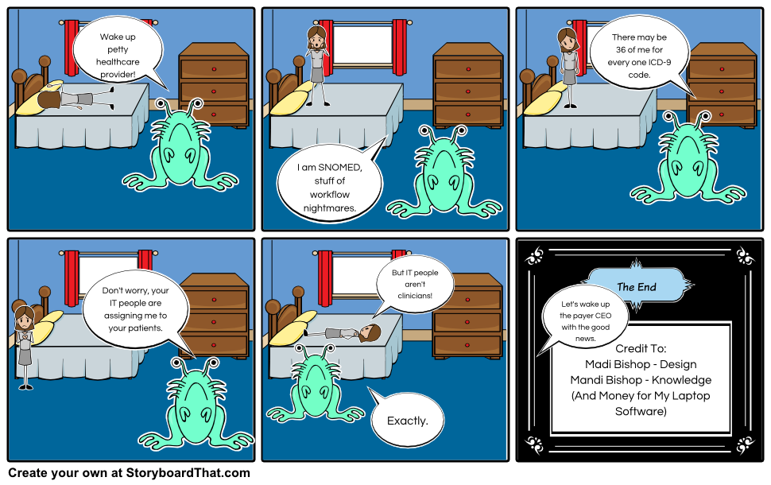

## MolecularMatch Conditions 2018 Update

In 2013, MolecularMatch integrated SNOMED-CT as the primary condition (disease) dataset for our technology. Oncologists and scientists at MM spent many months overriding that dataset so that it fits with modern cancer diagnoses. This included editing conditions, editing synonyms, adding new conditions, and create genetic composite conditions that didn't exist. Since then, SNOMED has improved in relation to oncology, and several open-source disease datasets have been launched. Matching patients to trials, drugs and assertion evidence guidelines depends on an accurate diagnoses and consistent interpretation between healthcare systems. Therefore in 2018, we upgraded our condition system, accomplishing the goals of:

1. Allowing cohesive code-based searching to improve EHR/Payer/LIMS integrations.
2. Updating to the most modern data ontologies.
3. Expanding operations outside of cancer.
4. Data validation (duplicates merging) with medical oversight.

---------

MolecularMatch NLP entity extraction and search engines run on ontologies. These include our conditions and findings, our in-house developed [Molecular Ontology](https://api.molecularmatch.com/#parentLevelMutations) and our global clinical trial aggregation. As our experience with data aggregation has grown, we've developed a protocol that allow for easy integration of big data into a beneficial search for patients. This high-level protocol is:

1. Acquire datasets in their native form on update intervals.
2. Identification strategy and merging to allow diverse inputs and avoid duplicates.
3. Incorporate into MMPower for searching.

---------

#### Condition Data Incorporated into MM
Condition terms are now searchable by prefix_code (e.g. `SNOMEDID_12345`).

| Search Prefix | Dataset Name | Records Count |
|---|---|---|
| SNOMEDID | SNOMED-CT | **313,940** |
| ICD10 | 10th rev. of the International Statistical Classification of Diseases | **94,127** |
| DOID | DiseaseOntology -- open source medical vocabulary | **12,498** |
| ONCOTREE | OncoTree -- curated cancer type ontology by MSKCC | **627** |

Additional datasets possibly worth integrating are: **ICD9** and **LOINC**. DiseaseOntology contains cross mapping of terms to MeSH, ICD, NCI’s thesaurus, SNOMED and OMIM.

All datasets can be easily updated on new releases. The current SNOMED-CT version is v20170901 U.S. edition.

---------

#### Dataset Mapping

We always design a feedback loop between clinical expertise and software automation. We do this by building easy to use, internal data management tools for training from M.D. and Ph.D. curators. This condition data upgrade required more than **100** M.D. pathologist curation hours.

ICD10 **→** SNOMED -- official mapping file used.

OncoTree **→** SNOMED -- MolecularMatch pathologist manually mapped.

DOID **→** SNOMED -- MolecularMatch pathologist manually mapped.


---------

#### Custom Conditions and Genetic Composites


---------

#### Lets Use It!
These codes can now be used in the whole MM ecosystem. From the application search, to API queries, to EHR integration.

##### App Search

http://app.molecularmatch.com/search/ICD10_D45
http://app.molecularmatch.com/search/SNOMEDID_12345
http://app.molecularmatch.com/search/DOID_0121
http://app.molecularmatch.com/search/ONCOTREE_AML

##### API Queries
See specs on http://api.molecularmatch.com

```
#################
# Trials Search -- save this as a .sh file
#################

# to run include apiKey as first argument
# $ chmod 777 file.sh
# $ ./file.sh apiKey

curl -X POST 'https://api.molecularmatch.com/v2/search/trials' \
--data "apiKey=$1" \
--data-urlencode 'filters=[ \
                  {"facet":"ICD10","term":"ICD10_D45"},  \
                  {"facet":"STATUS", "term":"Enrolling"}, \
                  {"facet":"TRIALTYPE", "term":"Interventional"} \
                  ]'

curl 'https://api.molecularmatch.com/v2/search/trials' \
--data "apiKey=$1" \
--data-urlencode 'filters=[ {"facet" : "SNOMEDID", "term" : "03387111"}]'
```

##### EHR Integration
Contact Us at <info@molecularmatch.com> for a demonstration of how to integrate with an EHR, payer system or LIMS.

---------

#### Mapping Trouble?
No mapping effort is perfect. Work with us to make sure you are getting the results you expect for your patients.


From: *http://healthstandards.com/blog/2014/04/21/snomed-problems/*
