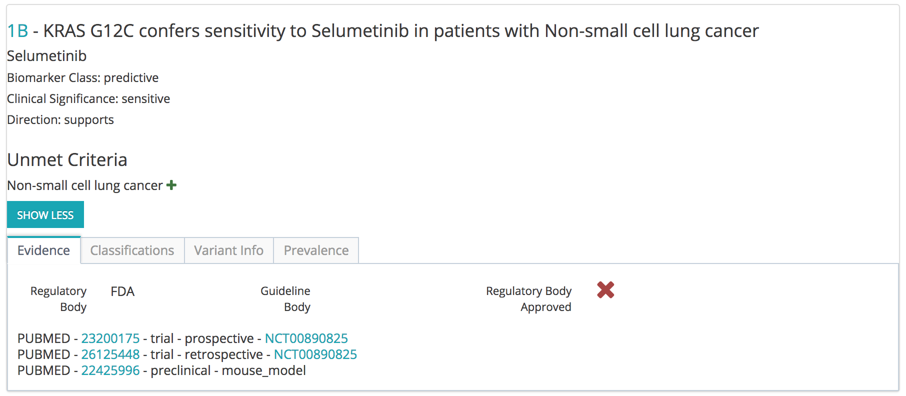

## Assertions API Detailed Docs
Based on documentation available at [api.molecularmatch.com](http://api.molecularmatch.com/#assertions)

### Assertion Search

Image from the [web application](http://assertions.molecularmatch.com). The app is good for discovery purposes or physician use.
>

#### Let's break down a typical search scenario
##### Looking for treatments with `supporting` evidence where the `biomarker` provided is `predictive` of drug `sensitivity`.

For Lung cancer patients with a BRAF mutation, where you only want to return exact mutation matches (strict), it would be queried like this:

```python
filters = [
	{"facet":"CLINICAL_SIGNIFICANCE", "term":"sensitive"},
	{"facet":"BIOMARKER_CLASS", "term":"predictive"},
	{"facet":"ASSERTION-DIRECTION", "term":"supports"},
	{"facet":"MUTATION", "term":"BRAF V600E"},
	{"facet":"CONDITION", "term":"Lung cancer"}
]
payload = {
	'apiKey': <my api key>,
	'filters': json.dumps(filters),
	'tieringTemplate': 'AMPCAP',
	'mode': 'strict'
}
url = 'https://api.molecularmatch.com/v2/assertion/search'
r = requests.post(url, json=payload)
print(json.dumps(r.json()))
```

Valid Values:

- BIOMARKER_CLASS --- `Predictive/Theranostic`, `Diagnostic`, `Prognostic`, `Unknown`
- CLINICAL_SIGNIFICANCE --- `Resistant`, `No Response`, `Sensitive`, `Favorable`, `Unfavorable`, `Unknown`
- DIRECTION --- `Supports`, `Does Not Support`
- tieringTemplate --- `AMPCAP`, `MVLD`

### Assertion Response



#### API Response
Here is the breakdown of the response, starting from the high-level, and digging into the fields of the assertion records.

High-level response.
>>> 

An overview of the record's fields
>>> 

This is the data (trials, publications, abstracts) that support the conclusion of the assertion.
>>> 

Detailed information on the mutations in this assertion.
>>> 

Other tiering system's scores have also been calculated.
>>> 

The criteria your search did not match. This assertion was for NSCLC, but you entered it's parent Lung cancer (root term = Malignant tumor of lung).
>>> 

Back at the high-level response, you see explanations of the tiering and the root terms your query rationalized to.
>>> 
